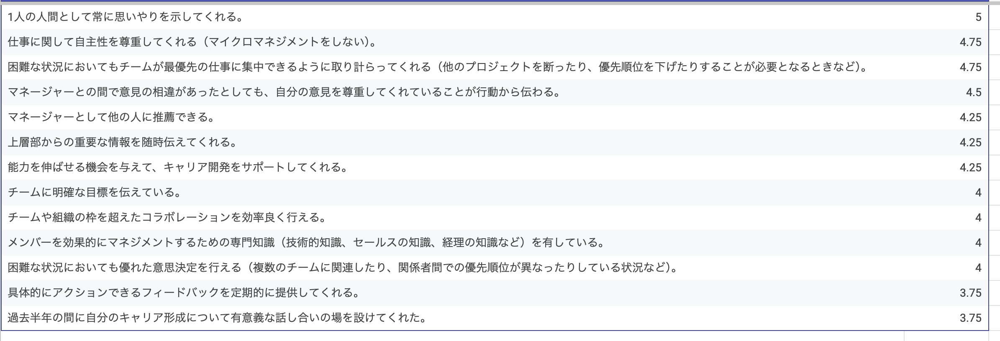

この記事は[10X 新春ブログリレー 2026](https://10xall.notion.site/10x-2026-newyearblogrelay)の1月11日分の記事です。

# はじめに

2024年11月からエンジニアリングマネージャー（以下EM）として働くようになり約1年が経つ2025年末のことですが[EMConf JP 2026](https://2026.emconf.jp/)のプロポーザル募集がありました。自分のふりかえりもかねてこの記事のタイトルでもある「俯瞰して支援し、いざとなれば先陣を切ってチームを機能させる ~スクラムマスター出身EM1年生の苦悩と学び~」というタイトルでプロポーザルを提出しましたが、不採択となりました。

この記事ではEMConf JP 2026で話すつもりだった内容を書いていきたいと思います。
# EMになるまでのキャリアサマリー

前職ではスクラムマスターや、複数チームの開発プロセス全体を改善する有志グループで活動したりしていました。
当時やっていたことはRSGT2019で発表する機会があったので、どんなことをやっていたのか見てもらうと想像しやすいかもしれません。

[スクラムチームを辞めて20人でカンバン運用してきた半年間の軌跡](https://www.docswell.com/s/futabooo/5DNMDN-rsgt2019)

10Xに入社してからはひたすら手を動かしてコードを書いて実装をしていましたが、昨年同じチームのEMが他のチームに移動する関係でEMを引き継ぐことになりました。これまでの社会人人生で初めてのEMに突然なることになったわけですが、スクラムマスターをやってきた経験からチームで成果をだすための活動はまぁやれるだろうなという楽観的な気持ちがありました。のちにこれは大きな間違いであったことに気づくわけですが...

# EM1年目をふりかえる

## 期中でのEM引き継ぎ、Whyの理解の浅い自分

[はじめに](#はじめに)にも書いたように組織上の変更によって元々同じチームのEMだったひとが移動することになり、誰がEMをやるのか選択肢がある中で私がEMを引き継ぐことになりました。

EMになったことで、語弊を恐れずに言えばこれまではメンバーとして半期のフォーカスの達成を目指していればよかったところが、なぜそのフォーカスなのかまた期中でもフォーカスの見直しをするべきと判断したらフォーカスを変えることも視野に入れて日々過ごすというようなことをやらねばならなくなりました。

なぜ今これをやる必要があるのか、他に優先すべきことはないのか常に意識しているというのが自分にはとても難しくて、本当にこれでいいのだろうか？と思っていると手を動かすことができずに停滞してしまうことが多くありました。手を動かしてコードを書く時もそうですが、なんでやるんだっけ？やる意味あるんだっけ？のようなWhyの部分の理解が浅かったり腹落ちしていなかったりするとアウトプットのスピードが極端に落ちることがあるので一旦やりきろう、まずはやりながら理解していこうという姿勢でなんとか物事を前に進めていきました。

2025下期のフォーカスを決める時はEMとして検討から決めるところまで関わったことで今フォーカスを達成するためのアクションを考えることやフォーカス自体の見直しなどに気を取られて手が止まることはなくやれていると思います。

---

## チームの合併、異なるケイパビリティ、広くなるチームのミッション

EMを引き継いで半年ほど経った2025年4月にはチームの合併がありました。合併時に少しでも早くチーム一丸となるためにやったことは別途[チームが合併する時にやったこと 〜共通認識、ナレッジ交換〜](https://10x.co.jp/blog/10xblog/10x-real-futabooo/)というブログを書いています。開発の進め方改善やチームのスループット向上のような部分はスクラムマスターとしての経験が生きる部分だったのでいい感じに合併を進めることができたのではないかと思っています。

一方でEMとしては、メンバーとの1on1をすることで変化に心理的な移行の部分のサポートを心がけていました。特に商品データチーム（僕が元々所属していなかったチーム）のメンバーにはこれまでやってきたことからのジャンプが一定必要で負荷が高いと感じていたためです。仕事は楽しくないといけない、楽しくやってる方がパフォーマンスが出ると思っているので1on1では楽しいですか？とか元気ですか？とかよく聞いていました。

新チームではこれまでと異なるケイパビリティをもってより広いドメインを担当することになりました。合併前にやっていた部分は優先順位をさげて商品データチームの持ち物だったドメインや技術領域を合併後のチーム全員で取り組むフォーメーションを組むことにしました。人が増えるので広く浅く一人一人にドメインを割り振る進め方のようなこともできると思いますが、フロー効率とリソース効率でいえばフロー効率を上げていく方がのぼり方としては正しいと判断してそのようにしました。

## メンバーの退職

これまでもチームのメンバーが退職する、会社のメンバーが退職するというのは経験していますが、自分がEMとして1on1をして色々話をしてきたメンバーが退職するというのは初めてでした。一緒に働いてる人が退職するのは寂しい、悲しいという気落ちが一定ありますが、本人の人生だしそこから先のことを考えるとポジティブな出来事でもあるととらえることができました。とはいえやっぱり残ってもらえるのであればその方がいいとは思います。この時も何か残る方向性はないのかと色々模索はしていたのですが最終的には退職となりました。

退職後もそのメンバーとはやりとりがあったりたまに会ったりもしていて、辞めた後でも関わりが保てているのは良い関係性をつくれていたのかな？と個人的には感じています。

チームの合併があったようにメンバーというのは増えることもあれば減ることもあります。そういったことが起こるものとして常々仕事に取り組むことが個人としては大事ですし、EMとしては仕組みで補強できるような状況を作っていくことが大事だと思います。

## メンバーからのフィードバックとひとりふりかえり

2025年上期の区切りで、チームの「ふりかえりとむきなおり」を実施しました。ふりかえりはよく山登りの途中で立ち止まって靴紐を結び直す行為に例えられますが「立ち止まって靴紐を結び直し、また安全に登るため」にやりました。またむきなおりは今チームが向かっている方向を再確認し、さらに半年後にチームやプロダクトがどうなっているのがよいかをチームで話し合いました。

またこの時およそ半年間の私のEMとしての活動がどうだったのかアンケートをとった結果と、それを元に次の半年でどんなアクションをしていくのかを共有しました。アンケートはGoogleがマネージャーの影響力を理解するために行なった調査を元に優れたマネージャーの10の行動様式を採点できるものをそのままGoogleFormで用意してくれていたのでそれを使わせてもらいました。

https://rework.withgoogle.com/intl/jp/guides/managers-research-behind-great-managers#try-googles-manager-feedback-survey

今見てみると既にGoogleFormのリンクは無くなってしまっていたので、どんな項目があったのかを記載しておきます。回答するメンバーにはそれぞれ5つの選択肢（そう思う、全くそう思わないのようなもの）から回答を選んでもらう形式です。

```
- マネージャーとして他の人に推薦できる。
- 能力を伸ばせる機会を与えて、キャリア開発をサポートしてくれる。
- チームに明確な目標を伝えている。
- 具体的にアクションできるフィードバックを定期的に提供してくれる。
- 仕事に関して自主性を尊重してくれる（マイクロマネジメントをしない）。
- 1人の人間として常に思いやりを示してくれる。
- 困難な状況においてもチームが最優先の仕事に集中できるように取り計らってくれる（他のプロジェクトを断ったり、優先順位を下げたりすることが必要となるときなど）。
- 上層部からの重要な情報を随時伝えてくれる。
- 過去半年の間に自分のキャリア形成について有意義な話し合いの場を設けてくれた。
- メンバーを効果的にマネジメントするための専門知識（技術的知識、セールスの知識、経理の知識など）を有している。
- マネージャーとの間で意見の相違があったとしても、自分の意見を尊重してくれていることが行動から伝わる。
- 困難な状況においても優れた意思決定を行える（複数のチームに関連したり、関係者間での優先順位が異なったりしている状況など）。
- チームや組織の枠を超えたコラボレーションを効率良く行える。
- マネージャーに今後も続けてほしいと思うことは何ですか？
- マネージャーに改めてほしいことは何ですか？
```

回答結果は以下のような感じでした。



フィードバックをいただき、改善の余地があると感じたので、SBIモデルにのっとって個人へのフィードバックを貯めていきます！という宣言をしました。希望があればメンバーへは1on1などで伝えていく感じです。
# スクラムマスターとEMの共通点と違い

1年間EMをやってきて、これまでのスクラムマスターの経験と比べた時にそれぞれの違いはリーダーシップのスタイルと結果責任を持つかどうかだと感じています。それ以外のことは共通していると感じています。

## 共通点

スクラムマスターとEMには、以下のような共通点があります。もっとたくさんあると思いますがパッと思いつく代表的な部分です。

- **チーム支援**: チームが最高のパフォーマンスを発揮できるよう支援する
- **プロセス改善**: 開発プロセスを継続的に改善していく
- **ファシリテーション**: チームの対話や意思決定を促進する

## リーダーシップのスタイルの違い

スクラムマスターのリーダーシップスタイルはサーバントリーダーシップです。最大の目的はチームの自己組織化であり、あくまで物事の主体はチームになります。決めるのはチームでありスクラムマスターは選択肢の提示や視野を広げる助けやそのために必要なきっかけづくりなどをサポートすることでチームの自己組織化を図り、最終的にはスクラムマスターがチームから離れることを目指します。

一方でEMのリーダーシップスタイルは指揮統制型リーダーシップです。チームがAorBのような判断に迷うことがあればAだ！と決めたり、チームの将来像を決めてそのために必要なアクションを自ら計画し実行をチームに委ねたり、主体がEM自身となります。どんな結果であれチームが出したアウトプットのよしあしの責任はEMにあります。

>私の主張をわかりやすくするためにあえてはっきりと違いを主張しています。上記以外のスタイルを否定するものではないですし、それぞれの状況によってリーダーシップスタイルは変化させることが実際の現場においては重要だと考えます。

## 結果責任を持つかどうかの違い

リーダーシップスタイルの違いの結果そうなるという感じな気もしますが、スクラムマスターは結果に責任を持たない立場であるため、成果が出なかった場合でもチームの責任として扱われることがあります。一方でEMは決めることをするひとでもあるので結果に責任を持つ必要があります。EMには正論で殴るみたいのは手段としてとることにあんまり意味ないっていう感じです。

# 苦悩と学び

スクラムマスターをやっていた期間が長いこともあってか、先に書いたようなリーダーシップのスタイルを使い分けるというのがとても難しかったです。いや今も難しいです。がんばって意識しないとすぐに俯瞰して支援する、一歩引いたところから理論的に説明するだけになりがちで当事者として自分も痛みを持って悩んだ上で最後覚悟を決めるみたいなところがなかなか難しいです。

またコーディングとEMのコーディング以外の仕事ではフィードバックが来るまでの期間が違うことも悩ましいです。コーディングであればなんかエラーがあったらすぐに教えてくれるし機能を作り終わってリリースしたらログがすぐに出てきます。一方でEMの多くの仕事はフィードバックが来るまでの期間が長いので僕がEMを経験した1年では、これまでやったことのフィードバックが返ってきてないことも多く選択が正しかったのか、もし誤りだったとして次回はどうすればいいのかというフィードバックループを回すことが難しいです。

難しくて悩むことも多いですがEMを経験したことでメンバーとしてはどうやってふるまうとチームのスループットが上げられるのかやどういう仕事の仕方をするとチームにやってることを伝えられるのか困らせないのかということがより解像度高くみえるようになったり、人を巻き込む調整するというような業務を通して技術的な意思決定をどうやって説明するかというところに応用が効くような経験もできているのでEMやってよかったなーと思っています。
# まとめと今後

この1年間のEM経験を通じて、チームを支援することはもちろん、「決めること」「最終責任を持つこと」の重要さを強く実感しました。スクラムマスターとして培った「対話」「プロセス改善」の素養は、より広い裁量や責任を持ったEMの役割でも土台として活きています。一方で、意思決定や外部への働きかけは、やってみて初めてその重みを知りました。

EMとして一歩踏み込むことで、技術やプロセスだけでなく、組織・チームのあり方に対しても主体的に関われる面白さと難しさがあります。最善手が分からず悩むことも多かったですが、その中で周りと対話を重ね、支援と決断のバランスを常に考え続けてきました。

今後も、チームや自分自身のありたい姿を言語化し続け、再現性のあるしくみとチャレンジの両立を目指していきます。EMとしてもICとしても、より良いチーム・組織づくりに貢献できるよう、自分なりのリーダーシップを探求していきたいと思います。
# おわりに

しばらくはEMやると思うのでまたEMConfにはプロポーザル出してどこかのタイミングで登壇したり、自分のようにEMとして苦悩している人とそれぞれの知見を共有してみんなのチームが成果を出せるいいチームになっていったいいなって思っています。

