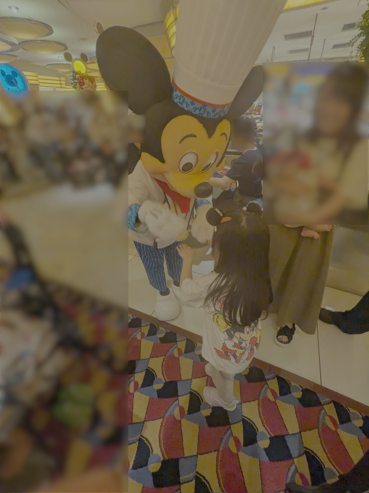
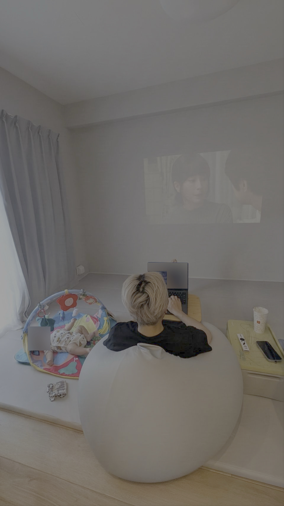

# 仕事

5/1に子どもがうまれたので育休に入って何もしてない。
半年の育休予定なのでこのふりかえりを書いてる時点で半分が終わったことになる。時が経つの早すぎるやばい。

# プライベート

## エアコン修理

3ヶ月ぐらい前にエアコン洗浄してもらったんだけど最近になって水漏れするようになったので原因を清掃業者に見てもらったけど原因不明、メーカーの人に来てもらうことになった。メーカーの人に見てもらったらパーツの一部が割れてて、そこから水漏れしてた。分解洗浄で必要以上に圧が加わって壊れる場合もあるし、経年劣化で壊れることもあるらしい。

メーカーの人が修理してくれたので水漏れは直ったのだが問題は修理費用を清掃業者が出すのかうちで出すのか相談することになった。タイミングも修理から時間が経ってしまっているし正直何が原因だったのかはわからないが、分解組み立てをしてるいじょうそれが多少なりとも影響してるのではないかと僕は思っていたので清掃業者へ費用を払ってもらう方向で話をした。メーカーの人曰く経年劣化があると言っても10年とか使ったら出てくるレベルで、まだ5年目だったしやはりそれが妥当だろうと思っていた。清掃業者的には払うのは問題ないが次回以降仕事は受けられないと言われてしまったが、それでもこちらが払うのは納得いかなかったので了承した。先方的にはいちゃもんつけてきた相手の家にまた行きたくないのはそうだよなーと思うし、うちは今回修理費用を払うのは納得がいかないのでいい塩梅の着地だったのかもしれない。

今回の件で、エアコン修理前後に写真撮るとかお互いのためにもしておいた方がいいと思った。次回以降は別の業者を探して依頼することになるが、その時は写真を撮ってもらおう。

## 実家に子ども連れて行く

子ども2人連れて僕の実家に1日だけ帰るっていうのをやった。妊娠、出産、産後の育児と常に1人になれない状態の妻を少しでもリフレッシュしいてもらいたいと思ってやった。1人で2人連れて電車にのって移動することに多少不安はあったけど、上の子がとても素直に話を聞いてくれたり念の為のハーネスもつけておいたりで無事移動することができた。実家のじぃじとばぁばは孫に会えて嬉しそうだった。

移動がまぁまぁ行けることがわかったのでまた定期的にやっていきたい。

いつも頑張ってくれている妻にも感謝である。

## 0歳児の予防接種

下の子の予防接種があった。

小さい体の両手両足に注射うたれてた、すごい頑張ってた。

自分が小さい時もこんなにたくさん予防接種ってしてたんだっけ？という気持ちにもなった。

## シェフミッキー

予約がなかなかできないシェフミッキー。前日のキャンセルが結構あることを妻が見つけてちょくちょく予約サイト見ていたらちょうどキャンセルが出て予約して行くことができた。

ごはん食べてるところにミッキーが来るだけなんだけどそれがすごいよい。ご飯もビュッフェスタイルを子どもが楽しんで好きなもの自分でとって食べれるしみんなハッピーだった。僕もミッキーと熱い握手を交わしたのでぜひまた行きたいと思った。

## 砂場活動

0歳児が夜まとめて寝てくれるようになったことで寝てる間に砂場活動することができるようになってきた。AIのおかげで作りたいものがシュッとできる割に技術スタック全然わからんみたいなことが悶々としてしまうので割とゆっくり質問を重ねながら進めている。

最近では昼間も機嫌がいい時間が長くなってきたので目の届く範囲において作業したりドラマ見たりもできるようになって嬉しい。

## おわりに

ミルク、オムツ変え、寝かしつけ、ミルク、オムツ変え、みたいなルーチーンで日々が終わって行くというよりはもう少し時間を色々なことに使えるようになってきて子どもの成長を感じる。あと3ヶ月いろいろやっていきたい。