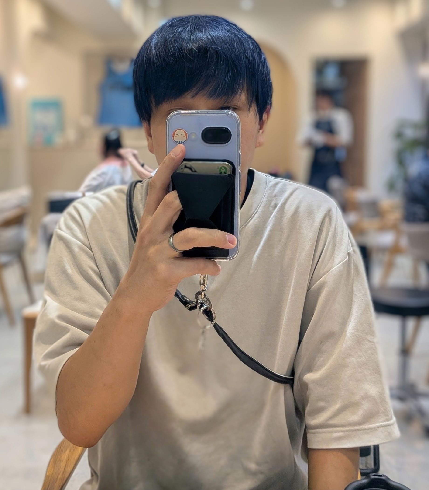
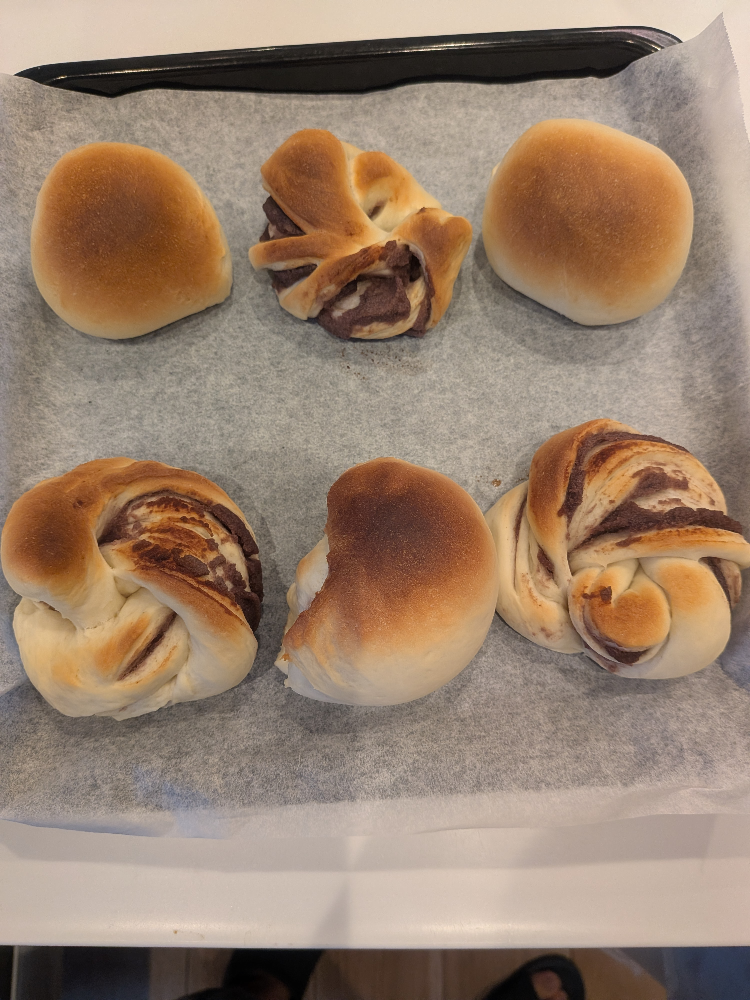

# 仕事

5/1からはじまった育休も残すところあと2ヶ月ほど。社会復帰できるか不安です。

# プライベート

8月はなんだかいっぱいイベントごとがあった気がする。

## 腰痛

8月の頭に腰を痛めてしまった。朝起きたらめちゃめちゃ腰が痛くて、最初は筋肉痛かとおもって様子を見ていたものの3日経っても治らないので整形外科に行った。
筋肉の損傷だろうということで湿布と飲み薬をもらった。

1週間ぐらいでだいぶよくなってきてこのまま治るといいなーとか思ってたら、子どものおむつを変えようとした時に感じたこともない痛みが腰に走って痛みが再発。整形外科にもう一度行ったらいわゆるぎっくり腰ということだった。追加で強めの痛み止めの薬もらって様子見と、リハビリ開始した。最初に痛めた日から1ヶ月ぐらい経った、この記事を書いてる今になってやっと治ってきていて多少なら荷物を持ってしゃがんだりもできるようになってきたので授乳やおむつがえもちょっとずつ復活させてる。

腰が痛い間ずっと妻に負担をかけてしまっていて申し訳ないので、もう2度と腰痛にならないように根本的な体の柔軟性を獲得したい。何かおすすめのエクササイズなどあればぜひおしえてください。

## スタジオアリス

100日記念の写真撮影のために家族でスタジオアリスに行った。袴？着た写真を撮ってもらったり、アイドルみたいな服を着て撮ってもらったり、オムツ一枚ではかりの上に乗せられて（合成で体重の数字にあわせてくれるやつ）撮ったりしてもらった。家族4人の集合写真も撮ってもらったのだけど、上の子の時に全員ボーダーT着て撮ったのを引き継いで4人全員ボーダーで撮った。今家には3人で撮ったときのやつと4人で撮ったときのやつが並べて飾ってある、だいぶいい感じ。

スタジオアリスのカメラマンさんはめちゃめちゃプロで赤ちゃんの視線をカメラに向ける技や笑顔を引き出す技を心得ている。それを見ているのも写真を撮ること以外の楽しみと言ってもいいとおもう。家でも写真撮る時に真似させてもらったりしてる。

## バリスタ体験

世の中は夏休みなのでキッズ向けのイベントが多い8月だった。近所のスタバでもバリスタ体験というのがやっていたので娘を連れて行ってきた。店員さんと同じ緑色のエプロンつけてフラペチーノとワッフルにホイップクリームを乗せる体験をさせてもらって、つくり終わったら自分で飲んで食べるっていうやつ。付き添いの大人もドリンク頼む必要があるけどほぼ商品の実費だけで素晴らしい体験をさせてもらったのでいってよかった。娘もすごい楽しそうだったのとなにより人生初フラペチーノの美味しさに感動してた。今度スタバ行ったらフラペチーノ買ってくれって言われるかもしれないけど、飲み過ぎると体に悪いことにして断ろうと思う。

バリスタ体験以外にもいろいろやってたし、定期的に開催するらしいので次また何か体験イベントがやってたら行きたい。

## 美容室

2ヶ月に一回家族で美容室に行くのが家族イベントになっている。育休中なので髪を青くしてもらった。色が落ちてくるとグレーになる感じで楽しみ。結構気に入ってるので定期的にやりたい気持ちもあるが、ブリーチとカラーとカットで時間もお金もかかるのでお休みが終わったら地毛に戻してカットだけ定期的にやるように戻そうと思う。

## 夏祭り

バスで15分ぐらい行ったところの大きめの夏祭りに家族で行ってきた。あいにくの天気でちょっと雨が降ったりしてたがみんなでカッパきて歩いて、そんな非日常も楽しむことができた。娘は去年の別の夏祭りでかき氷食べたのが嬉しかったらしくてかき氷食べに行くのも目的の一つだったんだけど雨降って寒くていらないと言われたｗ

ただ僕がじゃあ食べよーといってお店に行こうとすると自分も自分もという感じになって結局シロップかけるのやったりとかめっちゃ楽しそうにしてたのでよかった。

## 健康診断

1年に1回の健康診断、今年は胃カメラで生検取る事態になってドキドキしていたが良性ということで特に何もすることなく終わった。結果聞きに病院にもう一度行く必要があったんだけど、良性なら結果わかった時点で電話で何もなかったよ！って教えてくれたらいいのにと思う。結果を聞くために待合室で待った時間とかめっちゃドキドキしてたしなんで大丈夫ですっていうのを聞くためだけに行かないといけないのかよくわかってない。

## 社外の人とお話しする

育休中ということもあってなんだかんだで時間を自由に使えるので社外の人とちょこちょこお話ししたりランチいったりしている。転職全然考えてないけどそれでも良ければ話します！とはっきり言ってもみんなただの雑談でもいいからっていって時間を取ってくれるので大変ありがたい。結局そうやって話した人たちとはいざ転職を考えた時には第一想起で社名が上がってきたりするものなので採用する側からしたら大切な活動だよなーと自分が採用する側の時のことも考えたりした。

## パンを焼いた

焼きたてのパンはうまい、ということでパンを焼いたりした。正直、上手とは言えないし見栄えは綺麗じゃないんだけど熱々のうちに家族に食べてもらったりした時においしいって言ってもらえるのはめっちゃうれしい。個人的にもパンは好きで朝とか外出先とかでパンが選択肢にあると選びがちなところもあって、将来はパン屋さんになるのもいいんじゃないかと思い始めてる。

## 砂場活動

パンを焼くようになってレシピを変えた時に何がどう変わるのか？を記録しておかないと全然上手にできるようにならない気がしてそういったアプリをいくつか試してみたけど自分が満足いくものが見つけられなかった。最近は自分で作ったパンを記録するアプリを少しずつつくったり、そこから派生して実際に販売までするってなったときにあったら便利っぽいアプリを作ってみたりしている。AIのおかげで量をこなせるので最近のGitHubの草が本業で働いてる時よりも多い。